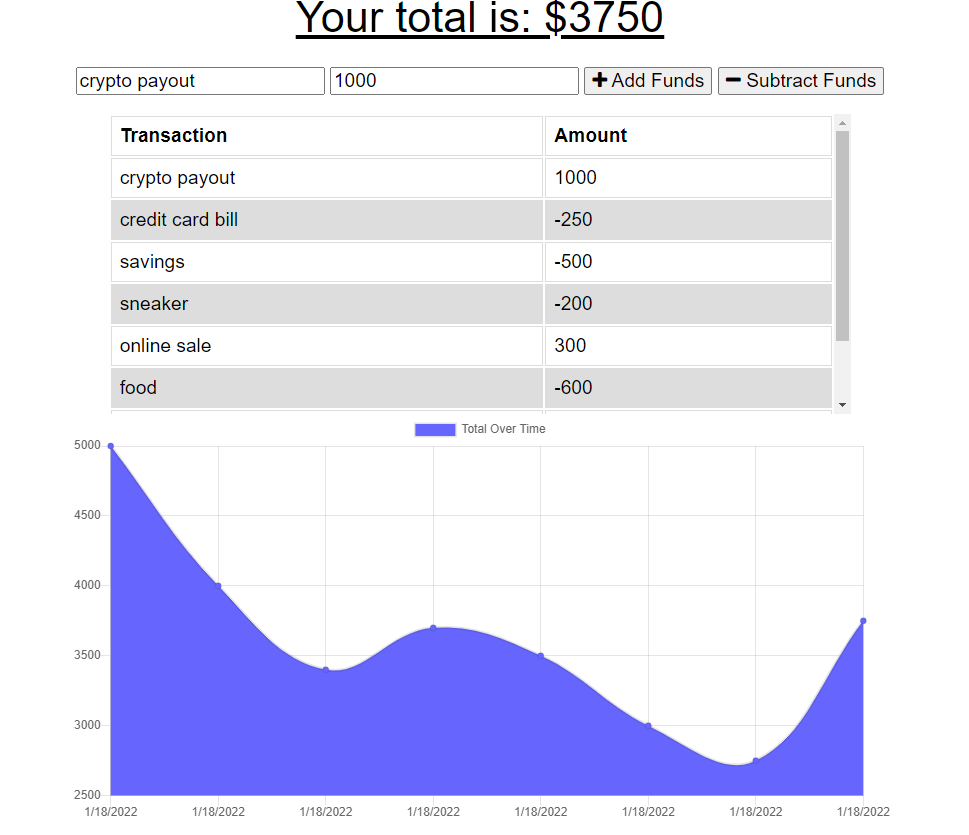

# Progressive Web Applications (PWA) Challenge: Budget Tracker

## Description
Easy to use finance and budget tracking app used to track incoming and outgoing cash flows and expenses. See how much your spending and what you're spending money on in real time. Not connected to the internet? No problem! Your inputs and outputs will be updated once your back online.

## User Story
AS AN avid traveler 
I WANT to be able to track my withdrawals and deposits with or without a data/internet connection 
SO THAT my account balance is accurate when I am traveling  

## Acceptance Criteria
GIVEN a budget tracker without an internet connection 
WHEN the user inputs an expense or deposit 
THEN they will receive a notification that they have added an expense or deposit 
WHEN the user reestablishes an internet connection 
THEN the deposits or expenses added while they were offline are added to their transaction history and their totals are updated 

## Screenshots

## Usage
[Deployed application](https://pwa-budget-tracker-19-app.herokuapp.com/)

## Contact
[Email](mailto:viakeegan@gmail.com) 
[GitHub](https://github.com/viakeegan) 
[Repo](https://github.com/viakeegan/pwa-budget-tracker-19) 
